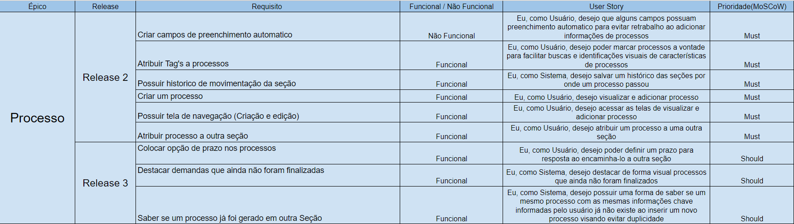
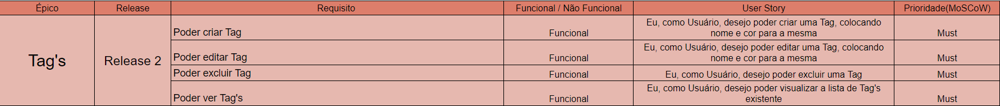

# Backlog do Produto

## Introdução

Durante a execução da Lean Inception, foi feito um brainstorming com os clientes e os envolvidos no projeto sobre as funcionalidades que deveriam ser implementadas, a partir disso foi feito o backlog do produto.

O backlog foi feito agrupando funcionalidades relacionadas, criado Épicos, cada Épico foi dividido em várias histórias de usuário.

Para a priorização das histórias de usuário, foi utilizada a técnica MoScoW.

## Backlog

### Épico: Processos

Poder criar, editar, deletar e visualizar os metadados dos processos, como também algumas funcionalidades que auxiliam o acompanhamento destes processos dentro do sistema pelos usuários

#### Histórias de usuário

### Épico: Usuários

Criar os tipos de usuários e suas permissões, além do acompanhamento (visualização) pelo administrador dos usuários cadastrados.

#### Histórias de usuário

### Épico: Filtro

Poder utilizar filtro para localizar processos de acordo com a necessidade do usuário.

#### Histórias de usuário

### Épico: Sistema

Funcionalidades que envolvem a visualização da plataforma, além da integração com os demais microsserviços.

#### Histórias de usuário

### Épico: Tag's

Possibilidade de criação, edição, exclusão e visualização das Tag's que irão ser utilizadas para as marcações de processos.

#### Histórias de usuário

### Épico: Restrição de Usuário

Requisito não funcional responsável por restringir o comportamento dos usuários atrelada ao seu nível de permissionamento dentro da plataforma.

#### Histórias de usuário

### Épico:Recuperar Senha

Funcionalidade para que o usuário possa recuperar a senha vinculada a sua conta.

#### Histórias de usuário
