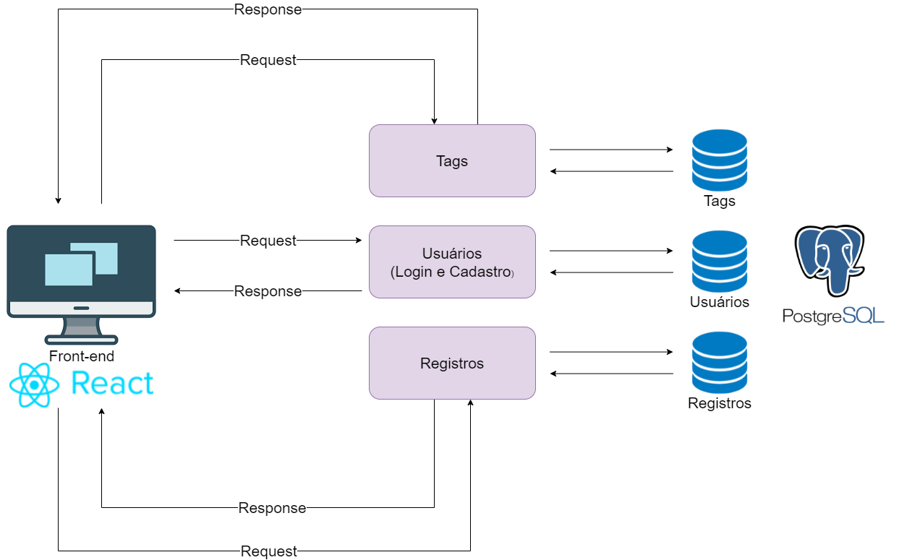

# Documento de Arquitetura

## Histórico de revisão

| Data       | Versão | Alteração                                                    | Autor                    |
| ---------- | ------ | ------------------------------------------------------------ | ------------------------ |
| 10/08/2021 | 0.1    | Abertura do documento de Arquitetura                         | Érico Maximiano Bandeira |
| 07/09/2021 | 0.2    | Adição da introdução e Representação da arquitetura          | Max Henrique Barbosa     |
| 11/09/2021 | 0.3    | Adição de imagem e alteração na Representação da arquitetura | Max Henrique Barbosa     |

## 1. Introdução

### 1.1 Finalidade

Este documento apresenta uma visão geral abrangente da arquitetura do projeto Oráculo, utilizando de uma série de visões arquiteturais diferentes para ilustrar os diversos aspectos do sistema. Este projeto fora realizado na disciplina Métodos de Densenvolvimento de Software em conjunto com a disciplina Engenharia de Produto de Software, e possui como principal cliente a Polícia Civil do Estado de Goiás.

### 1.2 Escopo

Neste documento serão descritos os componentes de software, padrões arquiteturais adotados e _frameworks_ escolhidos para o desenvolvimento do projeto que tem por objetivo a criação de um sistema que permita acesso e gerenciamento de metadados acerca de procesos que envolvam vários setores internos da Polícia Civil. O documento explora a fundo as características da arquitetura e como estas se relacionam com o projeto.

### 1.3 Definições, acrônimos e abreviações

| Abreviação | Significado                                                                              |
| ---------- | ---------------------------------------------------------------------------------------- |
| FGA        | Faculdade do Gama                                                                        |
| MDS        | Métodos de Desenvolvimento de Software                                                   |
| UNB        | Universidade de Brasília                                                                 |
| GIPC-GO    | Gerência de Identificação da Polícia Civil do Estado de Goiás                            |
| Backend    | Parte do sistema responsável por prover e organizar recursos para a interfáce do sistema |
| Frontend   | Parte do sistema responsável por ser a interfáce entre o sistema e o usuário             |
| API        | Application Programming Interface                                                        |

### 1.4 Visão Geral

Este documento contém os detalhes sobre as características arquiteturais que foram optadas pela equipe de desenvolvimento para a solução em software do projeto Oráculo. Nele estão contidos os seguintes pontos: Representação da Arquitetura, Tecnologias, Metas e restrições de Arquitetura, Visão lógica e Visão de implementação.

## 2. Representação da Arquitetura

<<<<<<< HEAD

=======

>>>>>>> d55059df2c2aa264711e0609a9596c1e90ae5979

O diagrama representa a divisão da aplicação em microsserviços de usuário, tags e de processos com suas correlações.

#### Microsserviços

Os microsserviços foram construídos utilizando Node.Js juntamente com Express.Js como framework, onde cada microsserviço tem um banco de dados independente. Para o controle e armazenamento dos dados, foi empregado o banco de dados relacional PostgreSQL.

A arquitetura do projeto **Oráculo** será desenvolvido utilizando uma arquitetura orientada a microserviços, onde cada serviço irá possuir um ambiente próprio para o seu desenvolvimento contendo a sua respectiva API para controle de dados sendo esses:

- Usuário: serviço responsável por conter as lógicas de autenticação e armazenar as informações dos usuários;

- Processos: serviço responsável pelo gerenciamento, registro, inicio e acompanhamento de processos internos;

- Tags: que serão utilizadas para auxiliar na marcação dos processos.

#### Front-End

A aplicação web utiliza no front-end o framework React. A divisão é feita em Pages, Services, Components e Constants

- Pages: armazena as telas do website.

- Services: local onde são realizadas as comunicações com a API.

- Components: reúne os componentes utilizados nas telas da aplicação, como botões e a navbar.

- Constants: armazena os códigos das cores utilizadas.

<!-- Adicionar imagem de representação -->

### 2.1 Tecnologias

#### Express.JS

O Node.js pode ser definido como um ambiente de execução Javascript server-side.

Express.js foi construído do zero para ser um aplicação flexível e minimalista de Node.js para montar aplicações robustas. Uma de suas principais características emerge de sua simplicidade: o framework não é focado em nenhum componente específico, não tem nenhum mecanismo de mapeamento objeto-relacional pronto para uso.

#### React

O front-end será desenvolvido utilizando o framework React esta que é uma biblioteca declarativa de JavaScript criada pelo Facebook em 2011 usada para a criação de interfaces de usuário, para otimizar a atualização e a sincronização de atividades simultâneas no feed de notícias da rede social. Com react a conexão entre HTML, CSS, JavaScript e os demais componentes acaba sendo simplificada.

#### PostgreSQL

O PostgreSQL tem o papel de gerenciar os dados desses bancos de maneira organizada e eficaz, rodando e gravando todas as informações que ficam registradas nesses compartimentos de maneira relacional.

## 3. Metas e restrições de Arquitetura

### 3.1 Metas

- Modularidade o código deve ter baixo acoplamento e alta modularidade, para facilitar a manutenabilidade
- Estabilidade do Sistema
- Fácil manutenção

### 3.2 Restrições
<<<<<<< HEAD
 - **Express.Js:** desenvolvimento dos microsserviços;
 - **React:** framework javascript utilizado para a criação da interface do usuário;
 - **PostgreSQL:** Banco de dados relacional.
=======
>>>>>>> d55059df2c2aa264711e0609a9596c1e90ae5979

- **Node.Js:** desenvolvimento dos microsserviços;
- **React:** framework javascript utilizado para a criação da interface do usuário;
- **PostgreSQL:** Banco de dados relacional.

## <!-- ### 3.3 Requisitos não funcionais

## 4. Visão dos Casos de Uso

### 4.1 Diagrama de Casos de Uso

### 4.2 Atores de Casos de Uso

| Ator | Descrição |
| ---- | --------- |
| -    | -         |

### 4.3 Descrições de Casos de Uso

| Épico | Caso de uso | Descrição |
| ----- | ----------- | --------- |
| E1    | -           | -         |
| E2    | -           | -         |
| E3    | -           | -         |

## 5. Visão Lógica

### 5.1 Diagrama de Pacotes

## 6. Tamanho e desempenho

## 7. Qualidade -->

## Referências

- Documentação do Postgre - https://www.postgresql.org/docs/
- Documentação do NodeJs - https://nodejs.org/en/docs/
- Documentação do React - https://pt-br.reactjs.org/
