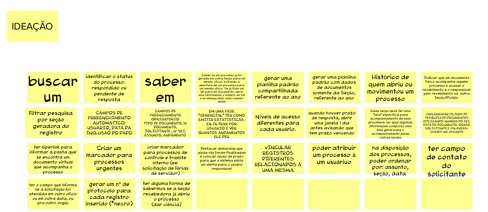

# Brainstoming De Funcionalidades

Esta atividade foi feita em conjunto com o cliente para saber que funcionalidades que vamos precisar no produto final.

Nessa etapa, fizemos eles terem o seguinte pensamento: "O usuário está tentando fazer uma coisa, então o produto deve ter uma funcionalidade para isso. Que funcionalidade é essa?". Depois de recolhermos os cartões com as funcionalidades, tivemos essas abaixo.

