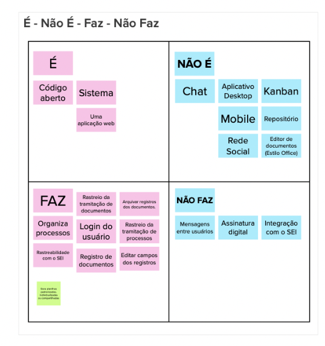

# É - Não é - Faz - Não faz

Com o objetivo de melhorar a visão de produto e de suas funcionalidades, o time inteiro discutiu sobre alguns objetivos do produto em si

Durante a dinâmica, o grupo foi adicionando cartão em cada setor do É - Não é - Faz - Não faz e depois passamos como um por um para ver se cada catão condizia com o objetivo do produto.

após ter definido os resultados preliminares, levamos a discussão com o cliente para que ele também aprove os objetivos do produto, depois dessa etapa tivemos esse resultado:

