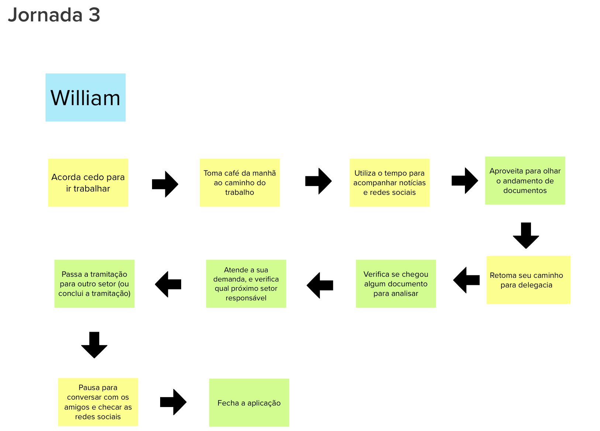

# Jornada de Usuário

A jornada de usuário é feita se baseando na atividade de Persona, para cada persona que foi criada, temos uma jornada diferente referente a esta persona, uma jornada de usuário pode ser definida como uma sequência de passos da persona em seu dia-a-dia, onde em algum momento dessa jornada, nosso produto será util para aquela persona.

A atividade foi feita com os grupos que fizeram a persona e ficaram responsáveis por idealizar a jornada da persona de sua criação, ao fim todos os membros juntos discutiram sobre os passos da jornada.

## Jornada de Usuário 1

## Jornada de Usuário 2

## Jornada de Usuário 3

