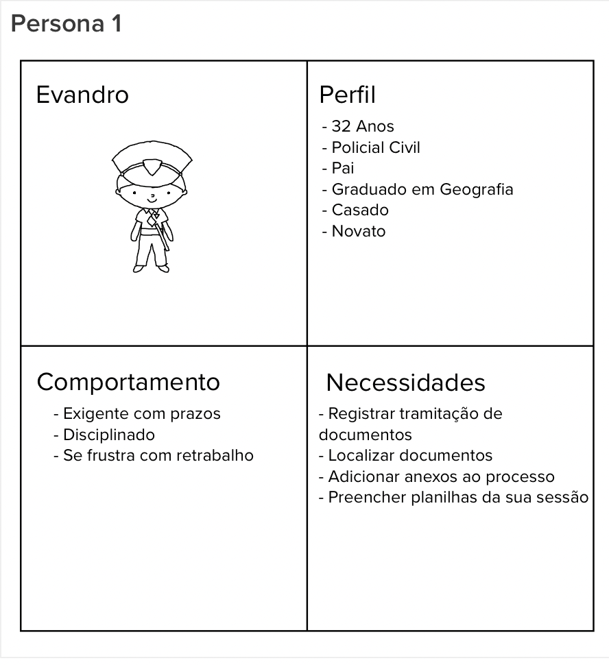

Uma persona é uma representação ficticia de usuários. uma persona é baseada em dados reais, comportamentos, objetivos, desafios e preocupações que um usuário do produto teria no seu dia-a-dia.

Para realizar a dinâmica o grupo foi dividido em três grupos de três pessoas e cada grupo ficou responsável por idealizar uma persona depois o grupo inteiro passava para visualizar e comentar sobre cada persona e ao final tivemos as três personas representadas abaixo.

## Persona 1

## Persona 2

## Persona 3

