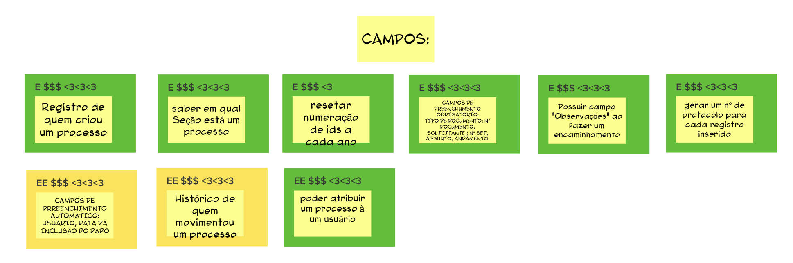

# Revisão Técnica, de Negócio e de UX

A etápa de brainstorming gera muitas funcionalidades, por isso precisamos analisar e filtrar cada uma das funcionalidades em termos de esforço (E), valor de negócio ($) e UX (<3) que seria o quão bom seria essa funcionalidade para o usuário.

para avaliarmos esses três fatores, utilizamos uma escala de um a três.

usamos tambêm uma classificação em cores, igual a tabela a cima para ter mais um parãmetro de comparação.

Nessa atividade, pegamos cada funcionalidade retirada na atividade passada e pontuamos cada um seguindo esses três termos e suas cores, tambêm pegamos algumas funcionalidades que eram muito próximas uma das outras e juntamos elas em um cartão só, sendo essas duas características que foram generalizadas os _campos_ e as _tags_.

No final tivemos essas funcionalidades, sendo duas que são um conjunto de várias outras.

## Funcionalidades

## Campos

## Tags

