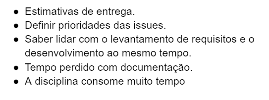

# Retrospectiva da Sprint 0

## Análise da sprint

- Foi feito o github pages e introduzida toda as documentações nele.
- Equipe começou a codificar o produto em si.
- A sprint teve vários hotfix para esse começo de desenvolvimento, contamos como uma adpataçao ao ambiente.

## Pontos Positivos listados pela equipe

## Pontos a Negativos listados pela equipe

## Pontos a Melhorar listados pela equipe

