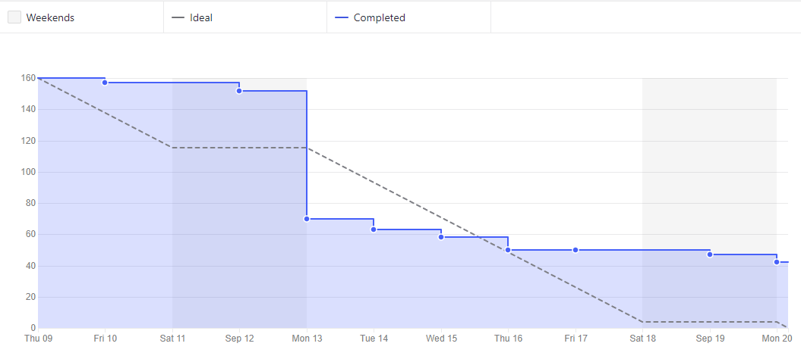
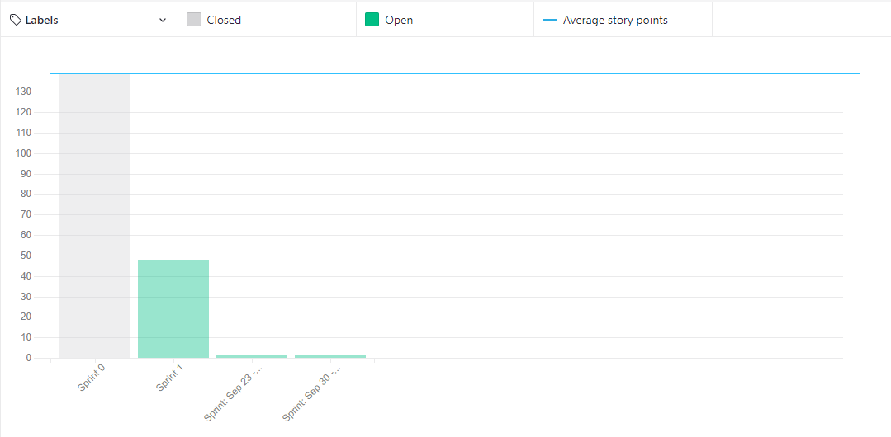
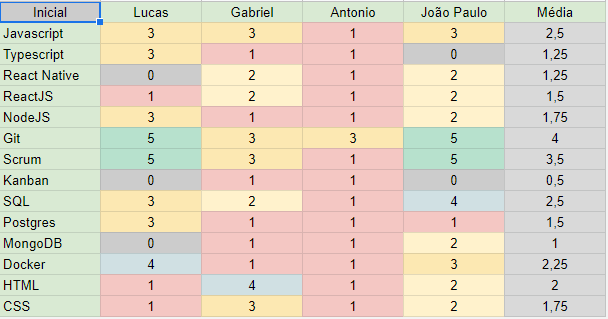

# Sprint 0 - Review

## Resultados obtidos na sprint 0

Na sprint 0 a quantidade de pontos concluídos foi elevada, pelo fato de ter vários pontos de documentação.

### Tarefas Realizadas:

| Tarefa                                                                                                                               | Pontuação | Concluída                                                                                                     |
| ------------------------------------------------------------------------------------------------------------------------------------ | --------- | ------------------------------------------------------------------------------------------------------------- |
| [Criar Documentação de Review da Sprint 8](https://github.com/fga-eps-mds/2020-2-SiGeD/issues/198)                                   | 2         | <image src="https://i.pinimg.com/originals/21/3d/c0/213dc0ed0a2e69d1978c75bfbcff903a.png" width=30 height=35> |
| [Criar Documentação de Planning da Sprint 10](https://github.com/fga-eps-mds/2020-2-SiGeD/issues/195)                                | 2         | <image src="https://i.pinimg.com/originals/21/3d/c0/213dc0ed0a2e69d1978c75bfbcff903a.png" width=30 height=35> |
| [Roadmap](https://github.com/fga-eps-mds/2020-2-SiGeD/issues/194)                                                                    | 3         | <image src="https://i.pinimg.com/originals/21/3d/c0/213dc0ed0a2e69d1978c75bfbcff903a.png" width=30 height=35> |
| [Atualizar template de Pull Requests](https://github.com/fga-eps-mds/2020-2-SiGeD/issues/189)                                        | 1         | <image src="https://i.pinimg.com/originals/21/3d/c0/213dc0ed0a2e69d1978c75bfbcff903a.png" width=30 height=35> |
| [Doc Pipeline](https://github.com/fga-eps-mds/2020-2-SiGeD/issues/200)                                                               | 2         | <image src="https://i.pinimg.com/originals/21/3d/c0/213dc0ed0a2e69d1978c75bfbcff903a.png" width=30 height=35> |
| [Consertar documento de arquitetura](https://github.com/fga-eps-mds/2020-2-SiGeD/issues/197)                                         | 1         | <image src="https://i.pinimg.com/originals/21/3d/c0/213dc0ed0a2e69d1978c75bfbcff903a.png" width=30 height=35> |
| [Gráfico de demandas por setor](https://github.com/fga-eps-mds/2020-2-SiGeD/issues/197)                                              | 3         | <image src="https://i.pinimg.com/originals/21/3d/c0/213dc0ed0a2e69d1978c75bfbcff903a.png" width=30 height=35> |
| [Gráfico/estatísticas de demandas por categorias](https://github.com/fga-eps-mds/2020-2-SiGeD/issues/201)                            | 3         | <image src="https://i.pinimg.com/originals/21/3d/c0/213dc0ed0a2e69d1978c75bfbcff903a.png" width=30 height=35> |
| [Fix - Modal de editar](https://github.com/fga-eps-mds/2020-2-SiGeD/issues/205)                                                      | 1         | <image src="https://i.pinimg.com/originals/21/3d/c0/213dc0ed0a2e69d1978c75bfbcff903a.png" width=30 height=35> |
| [FIX - Atualizar lista de usuários](https://github.com/fga-eps-mds/2020-2-SiGeD/issues/207)                                          | 1         | <image src="https://i.pinimg.com/originals/21/3d/c0/213dc0ed0a2e69d1978c75bfbcff903a.png" width=30 height=35> |
| [Corrigir multiplos alertas retornando respostas opostas](https://github.com/fga-eps-mds/2020-2-SiGeD/issues/208)                    | 1         | <image src="https://i.pinimg.com/originals/21/3d/c0/213dc0ed0a2e69d1978c75bfbcff903a.png" width=30 height=35> |
| [Fix - Modal de erro e sucesso](https://github.com/fga-eps-mds/2020-2-SiGeD/issues/211)                                              | 2         | <image src="https://i.pinimg.com/originals/21/3d/c0/213dc0ed0a2e69d1978c75bfbcff903a.png" width=30 height=35> |
| [Solicitar confirmação ao deletar algo e padronizar alertas](https://github.com/fga-eps-mds/2020-2-SiGeD/issues/212)                 | 2         | <image src="https://i.pinimg.com/originals/21/3d/c0/213dc0ed0a2e69d1978c75bfbcff903a.png" width=30 height=35> |
| [Enviar senha temporária](https://github.com/fga-eps-mds/2020-2-SiGeD/issues/199)                                                    | 3         | <image src="https://i.pinimg.com/originals/21/3d/c0/213dc0ed0a2e69d1978c75bfbcff903a.png" width=30 height=35> |
| [Recuperação de senha](https://github.com/fga-eps-mds/2020-2-SiGeD/issues/204)                                                       | 3         | <image src="https://i.pinimg.com/originals/21/3d/c0/213dc0ed0a2e69d1978c75bfbcff903a.png" width=30 height=35> |
| [Alteração de senha](https://github.com/fga-eps-mds/2020-2-SiGeD/issues/209)                                                         | 5         | <image src="https://i.pinimg.com/originals/21/3d/c0/213dc0ed0a2e69d1978c75bfbcff903a.png" width=30 height=35> |
| [Criação de um filtro, por ano, referente as demandas já criadas](https://github.com/fga-eps-mds/2020-2-SiGeD/issues/202)            | 2         | <image src="https://i.pinimg.com/originals/21/3d/c0/213dc0ed0a2e69d1978c75bfbcff903a.png" width=30 height=35> |
| [Network Docker](https://github.com/fga-eps-mds/2020-2-SiGeD/issues/203)                                                             | 2         | <image src="https://i.pinimg.com/originals/21/3d/c0/213dc0ed0a2e69d1978c75bfbcff903a.png" width=30 height=35> |
| [Criação de um filtro de categorias na tela de demandas](https://github.com/fga-eps-mds/2020-2-SiGeD/issues/210)                     | 2         | <image src="https://i.pinimg.com/originals/21/3d/c0/213dc0ed0a2e69d1978c75bfbcff903a.png" width=30 height=35> |
| [Filtro dos gráficos](https://github.com/fga-eps-mds/2020-2-SiGeD/issues/206)                                                        | 5         | <image src="https://i.pinimg.com/originals/21/3d/c0/213dc0ed0a2e69d1978c75bfbcff903a.png" width=30 height=35> |
| [Adicionar vídeo da apresentação da R1](https://github.com/fga-eps-mds/2021.1-Oraculo/issues/32)                                     | 3         | <image src="https://i.pinimg.com/originals/21/3d/c0/213dc0ed0a2e69d1978c75bfbcff903a.png" width=30 height=35> |
| [Adicionar Área de Equipe no DOCS](https://github.com/fga-eps-mds/2021.1-Oraculo/issues/29)                                          | 3         | <image src="https://i.pinimg.com/originals/21/3d/c0/213dc0ed0a2e69d1978c75bfbcff903a.png" width=30 height=35> |
| [Criar página de metodologia no Github Pages](https://github.com/fga-eps-mds/2021.1-Oraculo/issues/28)                               | 3         | <image src="https://i.pinimg.com/originals/21/3d/c0/213dc0ed0a2e69d1978c75bfbcff903a.png" width=30 height=35> |
| [Criar a home page no Github Pages](https://github.com/fga-eps-mds/2021.1-Oraculo/issues/27)                                         | 3         | <image src="https://i.pinimg.com/originals/21/3d/c0/213dc0ed0a2e69d1978c75bfbcff903a.png" width=30 height=35> |
| [Atualizar o Readme do Projeto](https://github.com/fga-eps-mds/2021.1-Oraculo/issues/26)                                             | 3         | <image src="https://i.pinimg.com/originals/21/3d/c0/213dc0ed0a2e69d1978c75bfbcff903a.png" width=30 height=35> |
| [Organização da navegação do github pages](https://github.com/fga-eps-mds/2021.1-Oraculo/issues/25)                                  | 3         | <image src="https://i.pinimg.com/originals/21/3d/c0/213dc0ed0a2e69d1978c75bfbcff903a.png" width=30 height=35> |
| [Arrumar nome do arquivo do sonar no pipeline de release](https://github.com/fga-eps-mds/2021.1-Oraculo/issues/24)                   | 3         | <image src="https://i.pinimg.com/originals/21/3d/c0/213dc0ed0a2e69d1978c75bfbcff903a.png" width=30 height=35> |
| [Configurar pipeline de release no Tags](https://github.com/fga-eps-mds/2021.1-Oraculo/issues/23)                                    | 3         | <image src="https://i.pinimg.com/originals/21/3d/c0/213dc0ed0a2e69d1978c75bfbcff903a.png" width=30 height=35> |
| [Configurar pipeline de release no Processos](https://github.com/fga-eps-mds/2021.1-Oraculo/issues/22)                               | 3         | <image src="https://i.pinimg.com/originals/21/3d/c0/213dc0ed0a2e69d1978c75bfbcff903a.png" width=30 height=35> |
| [Configurar pipeline de release no Profile](https://github.com/fga-eps-mds/2021.1-Oraculo/issues/21)                                 | 3         | <image src="https://i.pinimg.com/originals/21/3d/c0/213dc0ed0a2e69d1978c75bfbcff903a.png" width=30 height=35> |
| [Configurar pipeline de release no FrontEnd ](https://github.com/fga-eps-mds/2021.1-Oraculo/issues/20)                               | 3         | <image src="https://i.pinimg.com/originals/21/3d/c0/213dc0ed0a2e69d1978c75bfbcff903a.png" width=30 height=35> |
| [Configurar ambiente de desenvolvimento para o Tags](https://github.com/fga-eps-mds/2021.1-Oraculo/issues/19)                        | 5         | <image src="https://i.pinimg.com/originals/21/3d/c0/213dc0ed0a2e69d1978c75bfbcff903a.png" width=30 height=35> |
| [Configurar ambiente de desenvolvimento para o Processos](https://github.com/fga-eps-mds/2021.1-Oraculo/issues/18)                   | 5         | <image src="https://i.pinimg.com/originals/21/3d/c0/213dc0ed0a2e69d1978c75bfbcff903a.png" width=30 height=35> |
| [Configurar ambiente de desenvolvimento para o Profile](https://github.com/fga-eps-mds/2021.1-Oraculo/issues/17)                     | 5         | <image src="https://i.pinimg.com/originals/21/3d/c0/213dc0ed0a2e69d1978c75bfbcff903a.png" width=30 height=35> |
| [Criar um repositório para o Microsserviço de Login e Cadastro de Usuários](https://github.com/fga-eps-mds/2021.1-Oraculo/issues/16) | 3         | <image src="https://i.pinimg.com/originals/21/3d/c0/213dc0ed0a2e69d1978c75bfbcff903a.png" width=30 height=35> |
| [Definição da Identidade Visual](https://github.com/fga-eps-mds/2021.1-Oraculo/issues/15)                                            | 3         | <image src="https://i.pinimg.com/originals/21/3d/c0/213dc0ed0a2e69d1978c75bfbcff903a.png" width=30 height=35> |
| [Colocar Artefato de Quadros de Conhecimento e Pareamentos no Docs](https://github.com/fga-eps-mds/2021.1-Oraculo/issues/14)         | 3         | <image src="https://i.pinimg.com/originals/21/3d/c0/213dc0ed0a2e69d1978c75bfbcff903a.png" width=30 height=35> |
| [Criar um template de Issue para Histórias de Usuário ](https://github.com/fga-eps-mds/2021.1-Oraculo/issues/13)                     | 3         | <image src="https://i.pinimg.com/originals/21/3d/c0/213dc0ed0a2e69d1978c75bfbcff903a.png" width=30 height=35> |
| [Roadmap](https://github.com/fga-eps-mds/2021.1-Oraculo/issues/12)                                                                   | 3         | <image src="https://i.pinimg.com/originals/21/3d/c0/213dc0ed0a2e69d1978c75bfbcff903a.png" width=30 height=35> |
| [Colocar Artefatos da Lean Inception no Docs](https://github.com/fga-eps-mds/2021.1-Oraculo/issues/11)                               | 3         | <image src="https://i.pinimg.com/originals/21/3d/c0/213dc0ed0a2e69d1978c75bfbcff903a.png" width=30 height=35> |
| [Protótipo de alta fidelidade](https://github.com/fga-eps-mds/2021.1-Oraculo/issues/10)                                              | 5         | <image src="https://i.pinimg.com/originals/21/3d/c0/213dc0ed0a2e69d1978c75bfbcff903a.png" width=30 height=35> |
| [Protótipo de baixa fidelidade](https://github.com/fga-eps-mds/2021.1-Oraculo/issues/9)                                              | 8         | <image src="https://i.pinimg.com/originals/21/3d/c0/213dc0ed0a2e69d1978c75bfbcff903a.png" width=30 height=35> |
| [Código de Conduta](https://github.com/fga-eps-mds/2021.1-Oraculo/issues/8)                                                          | 3         | <image src="https://i.pinimg.com/originals/21/3d/c0/213dc0ed0a2e69d1978c75bfbcff903a.png" width=30 height=35> |
| [Backlog do Produto](https://github.com/fga-eps-mds/2021.1-Oraculo/issues/7)                                                         | 8         | <image src="https://i.pinimg.com/originals/21/3d/c0/213dc0ed0a2e69d1978c75bfbcff903a.png" width=30 height=35> |
| [Documento de Arquitetura](https://github.com/fga-eps-mds/2021.1-Oraculo/issues/6)                                                   | 8         | <image src="https://contmoura.com.br/wp-content/uploads/2019/09/x-png-icon-8.png" width=30 height=30>         |
| [Configurar ambiente de desenvolvimento para o FrontEnd](https://github.com/fga-eps-mds/2021.1-Oraculo/issues/5)                     | 5         | <image src="https://i.pinimg.com/originals/21/3d/c0/213dc0ed0a2e69d1978c75bfbcff903a.png" width=30 height=35> |
| [Configuração de Front-end](https://github.com/fga-eps-mds/2021.1-Oraculo/issues/4)                                                  | 5         | <image src="https://i.pinimg.com/originals/21/3d/c0/213dc0ed0a2e69d1978c75bfbcff903a.png" width=30 height=35> |
| [US01: Login de usuário no sistema](https://github.com/fga-eps-mds/2021.1-Oraculo/issues/30)                                         | 3         | <image src="https://i.pinimg.com/originals/21/3d/c0/213dc0ed0a2e69d1978c75bfbcff903a.png" width=30 height=35> |
| [US02: Possuir tela de navegação (Criação e edição de processo)](https://github.com/fga-eps-mds/2021.1-Oraculo/issues/31)            | 5         | <image src="https://i.pinimg.com/originals/21/3d/c0/213dc0ed0a2e69d1978c75bfbcff903a.png" width=30 height=35> |
| [US03: Criar Usuário](https://github.com/fga-eps-mds/2021.1-Oraculo/issues/33)                                                       | 5         | <image src="https://i.pinimg.com/originals/21/3d/c0/213dc0ed0a2e69d1978c75bfbcff903a.png" width=30 height=35> |
| [US04: Criar um processo](https://github.com/fga-eps-mds/2021.1-Oraculo/issues/34)                                                   | 5         | <image src="https://i.pinimg.com/originals/21/3d/c0/213dc0ed0a2e69d1978c75bfbcff903a.png" width=30 height=35> |
| [US05: Possuir historico de movimentação da seção](https://github.com/fga-eps-mds/2021.1-Oraculo/issues/35)                          | 5         | <image src="https://contmoura.com.br/wp-content/uploads/2019/09/x-png-icon-8.png" width=30 height=30>         |

### Burndown

### Velocity

### Conhecimento dos membros

