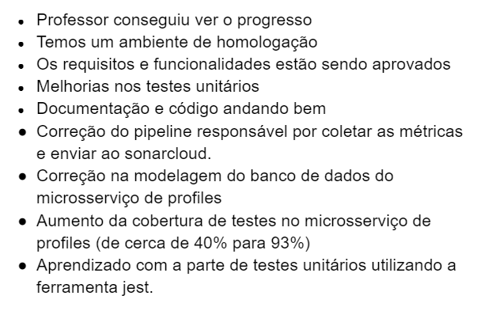
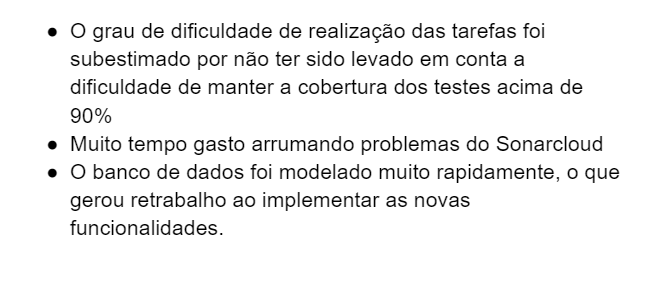

# Retrospectiva da Sprint 1

## Análise da sprint

- Foi feito muitas alterações no sonarcloud e no ambiente de testes, que atrasaram um pouco o desenvolvimento.
- Equipe começou a codificar muito a parte de testes e API.

## Pontos Positivos listados pela equipe

## Pontos a Negativos listados pela equipe

## Pontos a Melhorar listados pela equipe

