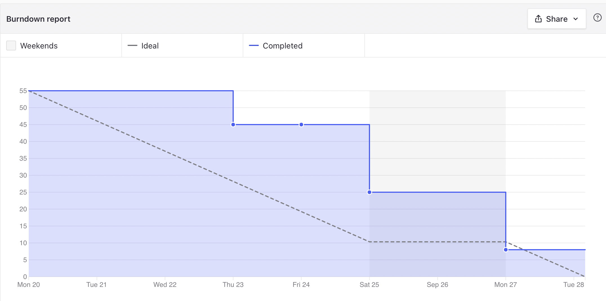
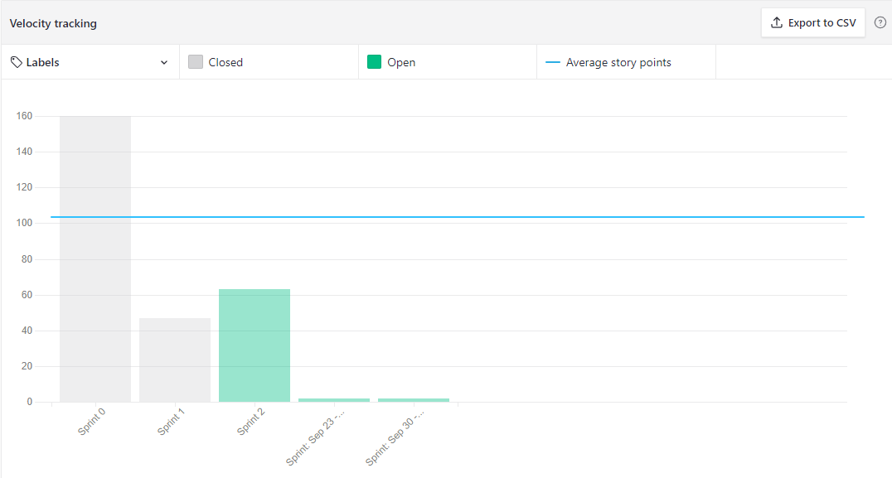

# Sprint 1 - Review

## Resultados obtidos na sprint 1

Na sprint 1 a quantidade de pontos concluídos mediana, pelo fato de ter o fechamento da sprint passada adiada, tivemos pouco tempo para esta sprint, então reduzimos um pouco a pontuação dela.

### Tarefas Realizadas:

| Issue                                                                                                                     | Pontos | Concluída                                                                                                     |
| ------------------------------------------------------------------------------------------------------------------------- | ------ | ------------------------------------------------------------------------------------------------------------- |
| [Configurar cobertura de testes nos microsserviços](https://github.com/fga-eps-mds/2021.1-Oraculo/issues/53)              | 5      | <image src="https://i.pinimg.com/originals/21/3d/c0/213dc0ed0a2e69d1978c75bfbcff903a.png" width=30 height=35> |
| [Trocar nome padrão do arquivo gerado pelo Sonarcloud](https://github.com/fga-eps-mds/2021.1-Oraculo/issues/54)           | 3      | <image src="https://i.pinimg.com/originals/21/3d/c0/213dc0ed0a2e69d1978c75bfbcff903a.png" width=30 height=35> |
| [Atualizar guia de contribuição](https://github.com/fga-eps-mds/2021.1-Oraculo/issues/59)                                 | 2      | <image src="https://i.pinimg.com/originals/21/3d/c0/213dc0ed0a2e69d1978c75bfbcff903a.png" width=30 height=35> |
| [Configurar envio automático do arquivo do sonarcloud](https://github.com/fga-eps-mds/2021.1-Oraculo/issues/60)           | 3      | <image src="https://i.pinimg.com/originals/21/3d/c0/213dc0ed0a2e69d1978c75bfbcff903a.png" width=30 height=35> |
| [Atualizar README do repositório Profile](https://github.com/fga-eps-mds/2021.1-Oraculo/issues/66)                        | 3      | <image src="https://i.pinimg.com/originals/21/3d/c0/213dc0ed0a2e69d1978c75bfbcff903a.png" width=30 height=35> |
| [Atualizar README do repositório Tags](https://github.com/fga-eps-mds/2021.1-Oraculo/issues/67)                           | 3      | <image src="https://i.pinimg.com/originals/21/3d/c0/213dc0ed0a2e69d1978c75bfbcff903a.png" width=30 height=35> |
| [Atualizar README de repositório Processos](https://github.com/fga-eps-mds/2021.1-Oraculo/issues/68)                      | 3      | <image src="https://i.pinimg.com/originals/21/3d/c0/213dc0ed0a2e69d1978c75bfbcff903a.png" width=30 height=35> |
| [Cobertura de código funcional no sonar cloud](https://github.com/fga-eps-mds/2021.1-Oraculo/issues/84)                   | 5      | <image src="https://i.pinimg.com/originals/21/3d/c0/213dc0ed0a2e69d1978c75bfbcff903a.png" width=30 height=35> |
| [Atualizar Readme do FrontEnd](https://github.com/fga-eps-mds/2021.1-Oraculo/issues/63)                                   | 3      | <image src="https://i.pinimg.com/originals/21/3d/c0/213dc0ed0a2e69d1978c75bfbcff903a.png" width=30 height=35> |
| [US09: Criar Níveis de acesso diferentes para cada usuário](https://github.com/fga-eps-mds/2021.1-Oraculo/issues/39)      | 5      | <image src="https://contmoura.com.br/wp-content/uploads/2019/09/x-png-icon-8.png" width=30 height=30>         |
| [US10: Permitir a uma conta administradora, criar outras contas](https://github.com/fga-eps-mds/2021.1-Oraculo/issues/40) | 3      | <image src="https://contmoura.com.br/wp-content/uploads/2019/09/x-png-icon-8.png" width=30 height=30>         |
| [US11: Visualizar lista de usuários cadastrados](https://github.com/fga-eps-mds/2021.1-Oraculo/issues/41)                 | 3      | <image src="https://i.pinimg.com/originals/21/3d/c0/213dc0ed0a2e69d1978c75bfbcff903a.png" width=30 height=35> |
| [Padronização de Cores no FrontEnd](https://github.com/fga-eps-mds/2021.1-Oraculo/issues/61)                              | 3      | <image src="https://i.pinimg.com/originals/21/3d/c0/213dc0ed0a2e69d1978c75bfbcff903a.png" width=30 height=35> |
| [Adicionar fonte Montserrat](https://github.com/fga-eps-mds/2021.1-Oraculo/issues/41)                                     | 3      | <image src="https://i.pinimg.com/originals/21/3d/c0/213dc0ed0a2e69d1978c75bfbcff903a.png" width=30 height=35> |

### Burndown

### Velocity

### Conhecimento dos membros

