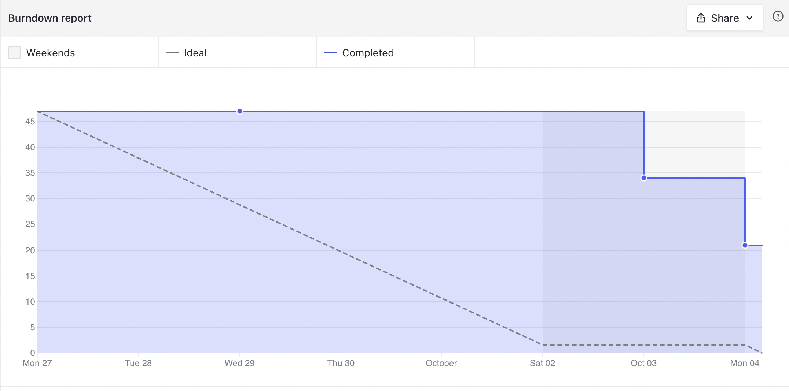
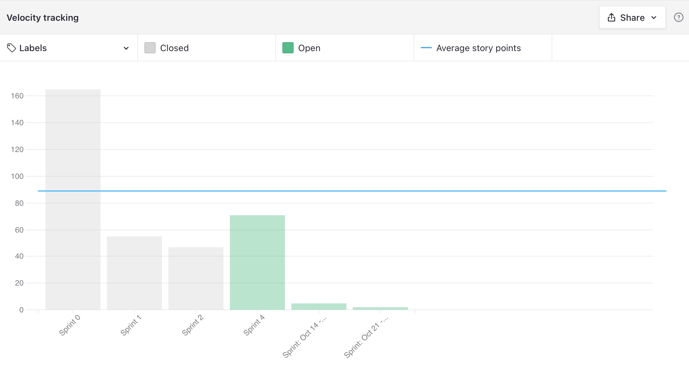

# Sprint 2 - Review

## Resultados obtidos na sprint 2

Na sprint 2 a quantidade de pontos concluídos elevada, pois houve muitos pontos nessa sprint, porém teve muitas não concluídas também pelo mesmo motivo

### Tarefas Realizadas:

| Issue                                                                                                                               | Pontos | Concluída                                                                                                     |
| ----------------------------------------------------------------------------------------------------------------------------------- | ------ | ------------------------------------------------------------------------------------------------------------- |
| [US36: Tela de visualizar usuário](https://github.com/fga-eps-mds/2021.1-Oraculo/issues/90)                                         | 3      | <image src="https://i.pinimg.com/originals/21/3d/c0/213dc0ed0a2e69d1978c75bfbcff903a.png" width=30 height=35> |
| [US35: Reabrir processo](https://github.com/fga-eps-mds/2021.1-Oraculo/issues/89)                                                   | 8      | <image src="https://contmoura.com.br/wp-content/uploads/2019/09/x-png-icon-8.png" width=30 height=30>         |
| [US34: Concluir processo](https://github.com/fga-eps-mds/2021.1-Oraculo/issues/88)                                                  | 8      | <image src="https://contmoura.com.br/wp-content/uploads/2019/09/x-png-icon-8.png" width=30 height=30>         |
| [Colocar as aplicações disponíveis em um ambiente de homologação com link](https://github.com/fga-eps-mds/2021.1-Oraculo/issues/87) | 5      | <image src="https://contmoura.com.br/wp-content/uploads/2019/09/x-png-icon-8.png" width=30 height=30>         |
| [Criação de componentes para o Front-end ](https://github.com/fga-eps-mds/2021.1-Oraculo/issues/85)                                 | 5      | <image src="https://i.pinimg.com/originals/21/3d/c0/213dc0ed0a2e69d1978c75bfbcff903a.png" width=30 height=35> |
| [US28: Páginas para editar usuário](https://github.com/fga-eps-mds/2021.1-Oraculo/issues/78)                                        | 3      | <image src="https://contmoura.com.br/wp-content/uploads/2019/09/x-png-icon-8.png" width=30 height=30>         |
| [US27: Fazer tela de cadastro](https://github.com/fga-eps-mds/2021.1-Oraculo/issues/77)                                             | 5      | <image src="https://i.pinimg.com/originals/21/3d/c0/213dc0ed0a2e69d1978c75bfbcff903a.png" width=30 height=35> |
| [US24: Telas de visualização de processos (processos e meus processos) ](https://github.com/fga-eps-mds/2021.1-Oraculo/issues/74)   | 5      | <image src="https://i.pinimg.com/originals/21/3d/c0/213dc0ed0a2e69d1978c75bfbcff903a.png" width=30 height=35> |
| [US23: Tela de visualizar processo](https://github.com/fga-eps-mds/2021.1-Oraculo/issues/73)                                        | 8      | <image src="https://contmoura.com.br/wp-content/uploads/2019/09/x-png-icon-8.png" width=30 height=30>         |
| [US17: Poder ver Tag's ](https://github.com/fga-eps-mds/2021.1-Oraculo/issues/47)                                                   | 8      | <image src="https://i.pinimg.com/originals/21/3d/c0/213dc0ed0a2e69d1978c75bfbcff903a.png" width=30 height=35> |
| [US15: Poder editar Tag ](https://github.com/fga-eps-mds/2021.1-Oraculo/issues/45)                                                  | 8      | <image src="https://i.pinimg.com/originals/21/3d/c0/213dc0ed0a2e69d1978c75bfbcff903a.png" width=30 height=35> |
| [US14: Poder criar Tag](https://github.com/fga-eps-mds/2021.1-Oraculo/issues/44)                                                    | 13     | <image src="https://i.pinimg.com/originals/21/3d/c0/213dc0ed0a2e69d1978c75bfbcff903a.png" width=30 height=35> |

| [US09: Criar Níveis de acesso diferentes para cada usuário](https://github.com/fga-eps-mds/2021.1-Oraculo/issues/39) | 5 | |
| [Padronização de Cores no FrontEnd](https://github.com/fga-eps-mds/2021.1-Oraculo/issues/61) | 3 | |

### Burndown

### Velocity

### Conhecimento dos membros

