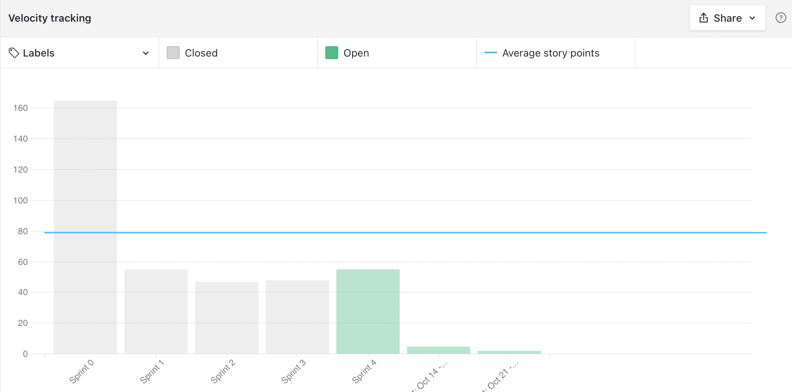

# Sprint 3 - Review

## Resultados obtidos na sprint 3

Na sprint 3 a quantidade de pontos foi mediana levando em conta que agora o time está mais conhecido de suas experiências e conhecimentos tecnicos para fazer as tarefas.

### Tarefas Realizadas:

| Issue                                                                                                                          | Pontos | Concluída                                                                                                     |
| ------------------------------------------------------------------------------------------------------------------------------ | ------ | ------------------------------------------------------------------------------------------------------------- |
| [US24: Telas de visualização de registros](https://github.com/fga-eps-mds/2021.1-Oraculo/issues/74)                            | 13     | <image src="https://i.pinimg.com/originals/21/3d/c0/213dc0ed0a2e69d1978c75bfbcff903a.png" width=30 height=35> |
| [US34: Concluir registro](https://github.com/fga-eps-mds/2021.1-Oraculo/issues/88)                                             | 8      | <image src="https://contmoura.com.br/wp-content/uploads/2019/09/x-png-icon-8.png" width=30 height=30>         |
| [Adicionar "Gerenciamento de Riscos" a documentação](https://github.com/fga-eps-mds/2021.1-Oraculo/issues/93)                  | 5      | <image src="https://i.pinimg.com/originals/21/3d/c0/213dc0ed0a2e69d1978c75bfbcff903a.png" width=30 height=35> |
| [Adicionar EVM a documentação](https://github.com/fga-eps-mds/2021.1-Oraculo/issues/92)                                        | 8      | <image src="https://i.pinimg.com/originals/21/3d/c0/213dc0ed0a2e69d1978c75bfbcff903a.png" width=30 height=35> |
| [US36: Tela de visualizar usuário](https://github.com/fga-eps-mds/2021.1-Oraculo/issues/90)                                    | 5      | <image src="https://i.pinimg.com/originals/21/3d/c0/213dc0ed0a2e69d1978c75bfbcff903a.png" width=30 height=35> |
| [Corrigir configuração do CORS em todos os microsserviços de backend](https://github.com/fga-eps-mds/2021.1-Oraculo/issues/97) | 3      | <image src="https://i.pinimg.com/originals/21/3d/c0/213dc0ed0a2e69d1978c75bfbcff903a.png" width=30 height=35> |
| [Criar endpoint de coletar dados de um usuário específico](https://github.com/fga-eps-mds/2021.1-Oraculo/issues/94)            | 3      | <image src="https://i.pinimg.com/originals/21/3d/c0/213dc0ed0a2e69d1978c75bfbcff903a.png" width=30 height=35> |
| [Adicionar campo "nome" na tabela de usuários](https://github.com/fga-eps-mds/2021.1-Oraculo/issues/96)                        | 5      | <image src="https://i.pinimg.com/originals/21/3d/c0/213dc0ed0a2e69d1978c75bfbcff903a.png" width=30 height=35> |
| [Adicionar campo "nome" na tabela de usuários](https://github.com/fga-eps-mds/2021.1-Oraculo/issues/96)                        | 5      | <image src="https://i.pinimg.com/originals/21/3d/c0/213dc0ed0a2e69d1978c75bfbcff903a.png" width=30 height=35> |

### Burndown

### Velocity

### Conhecimento dos membros

