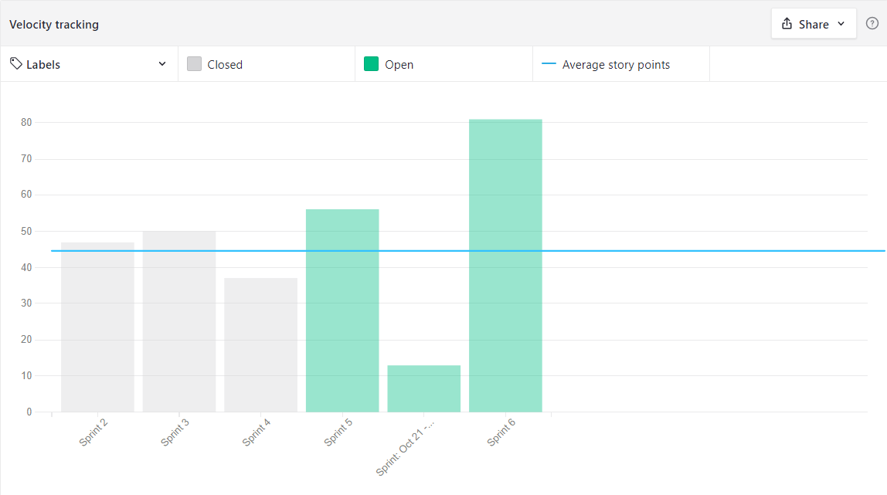
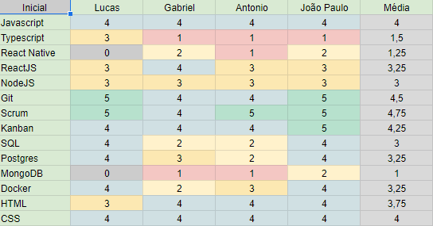

# Sprint 5 - Review

## Resultados obtidos na sprint 5

Na sprint 5 a quantidade de pontos foi elevada, pois estamos com o prazo apertado e dedicamos muito mais a sprint.

### Tarefas Realizadas:

| Issue                                                                                                                                 | Pontos | Concluída                                                                                                     |
| ------------------------------------------------------------------------------------------------------------------------------------- | ------ | ------------------------------------------------------------------------------------------------------------- |
| [Criar request para o número total de registros](https://github.com/fga-eps-mds/2021.1-Oraculo/issues/100)                            | 3      | <image src="https://i.pinimg.com/originals/21/3d/c0/213dc0ed0a2e69d1978c75bfbcff903a.png" width=30 height=35> |
| [US26: Tela de Homepage](https://github.com/fga-eps-mds/2021.1-Oraculo/issues/76)                                                     | 13     | <image src="https://contmoura.com.br/wp-content/uploads/2019/09/x-png-icon-8.png" width=30 height=30>         |
| [US26: Tela de Homepage](https://github.com/fga-eps-mds/2021.1-Oraculo/issues/76)                                                     | 13     | <image src="https://i.pinimg.com/originals/21/3d/c0/213dc0ed0a2e69d1978c75bfbcff903a.png" width=30 height=35> |
| [US23: Tela de visualizar registro](https://github.com/fga-eps-mds/2021.1-Oraculo/issues/73)                                          | 8      | <image src="https://i.pinimg.com/originals/21/3d/c0/213dc0ed0a2e69d1978c75bfbcff903a.png" width=30 height=35> |
| [US21: Poder alterar senha do usuário](https://github.com/fga-eps-mds/2021.1-Oraculo/issues/51)                                       | 5      | <image src="https://i.pinimg.com/originals/21/3d/c0/213dc0ed0a2e69d1978c75bfbcff903a.png" width=30 height=35> |
| [US20: Tela para alterar senha do usuário](https://github.com/fga-eps-mds/2021.1-Oraculo/issues/50)                                   | 3      | <image src="https://i.pinimg.com/originals/21/3d/c0/213dc0ed0a2e69d1978c75bfbcff903a.png" width=30 height=35> |
| [US29: No microsserviço conseguir editar usuário](https://github.com/fga-eps-mds/2021.1-Oraculo/issues/79)                            | 13     | <image src="https://contmoura.com.br/wp-content/uploads/2019/09/x-png-icon-8.png" width=30 height=30>         |
| [US28: Páginas para editar usuário](https://github.com/fga-eps-mds/2021.1-Oraculo/issues/78)                                          | 3      | <image src="https://contmoura.com.br/wp-content/uploads/2019/09/x-png-icon-8.png" width=30 height=30>         |
| [US30: Criar tela de visualização de todos os campos](https://github.com/fga-eps-mds/2021.1-Oraculo/issues/80)                        | 5      | <image src="https://i.pinimg.com/originals/21/3d/c0/213dc0ed0a2e69d1978c75bfbcff903a.png" width=30 height=35> |
| [Adicionar campo para armazenar dado do usuário que encaminhou um registro](https://github.com/fga-eps-mds/2021.1-Oraculo/issues/109) | 5      | <image src="https://contmoura.com.br/wp-content/uploads/2019/09/x-png-icon-8.png" width=30 height=30>         |
| [Adicionar endpoint para retornar a lista de departamentos cadastrados](https://github.com/fga-eps-mds/2021.1-Oraculo/issues/76)      | 13     | <image src="https://i.pinimg.com/originals/21/3d/c0/213dc0ed0a2e69d1978c75bfbcff903a.png" width=30 height=35> |
| [Atualizar workflow de release](https://github.com/fga-eps-mds/2021.1-Oraculo/issues/110)                                             | 5      | <image src="https://i.pinimg.com/originals/21/3d/c0/213dc0ed0a2e69d1978c75bfbcff903a.png" width=30 height=35> |
| [Implementar login no microsserviço de registros](https://github.com/fga-eps-mds/2021.1-Oraculo/issues/105)                           | 13     | <image src="https://contmoura.com.br/wp-content/uploads/2019/09/x-png-icon-8.png" width=30 height=30>         |

### Burndown

### Velocity

### Conhecimento dos membros

