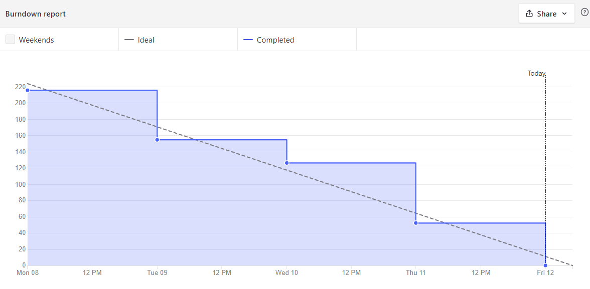
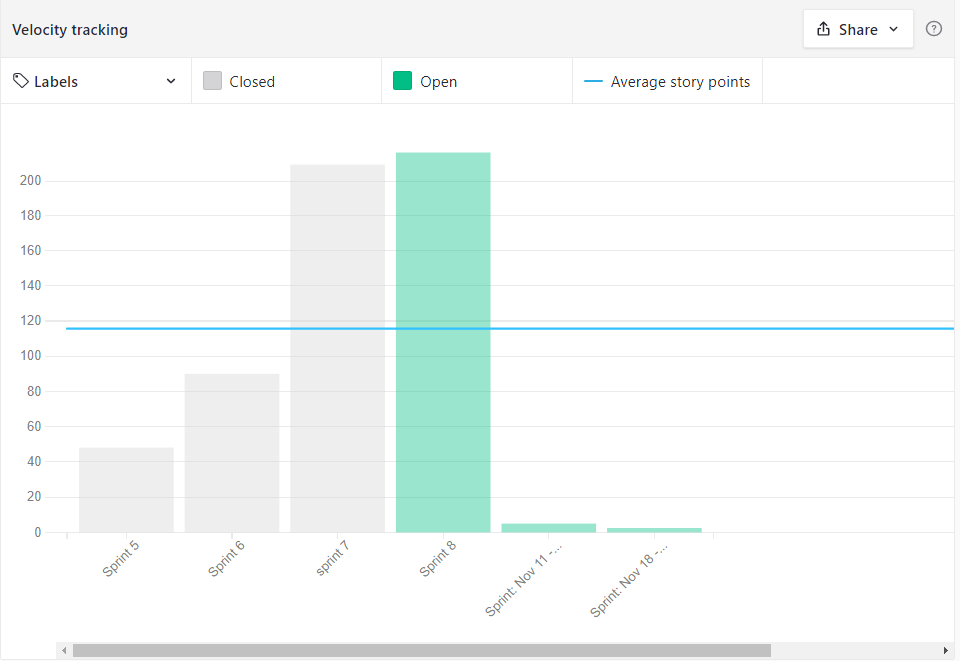

# Sprint 8- Review

## Resultados obtidos na sprint 8

Na sprint 8 a quantidade de pontos também foi elevada, pois está chegando perto do ultimo dia de projeto.

### Tarefas Realizadas:

| Issue                                                                                                                                    | Pontos | Concluída                                                                                                     |
| ---------------------------------------------------------------------------------------------------------------------------------------- | ------ | ------------------------------------------------------------------------------------------------------------- |
| [Edição de Departamentos](https://github.com/fga-eps-mds/2021.1-Oraculo/issues/187)                                                      | 5      | <image src="https://i.pinimg.com/originals/21/3d/c0/213dc0ed0a2e69d1978c75bfbcff903a.png" width=30 height=35> |
| [Alertar usuário que o token expirou](https://github.com/fga-eps-mds/2021.1-Oraculo/issues/204)                                          | 3      | <image src="https://i.pinimg.com/originals/21/3d/c0/213dc0ed0a2e69d1978c75bfbcff903a.png" width=30 height=35> |
| [Alertar usuário que o acesso foi negado](https://github.com/fga-eps-mds/2021.1-Oraculo/issues/205)                                      | 3      | <image src="https://i.pinimg.com/originals/21/3d/c0/213dc0ed0a2e69d1978c75bfbcff903a.png" width=30 height=35> |
| [Unificação de Seções e Departamentos](https://github.com/fga-eps-mds/2021.1-Oraculo/issues/186)                                         | 13     | <image src="https://i.pinimg.com/originals/21/3d/c0/213dc0ed0a2e69d1978c75bfbcff903a.png" width=30 height=35> |
| [Trocar Titulo e Favicon](https://github.com/fga-eps-mds/2021.1-Oraculo/issues/200)                                                      | 3      | <image src="https://i.pinimg.com/originals/21/3d/c0/213dc0ed0a2e69d1978c75bfbcff903a.png" width=30 height=35> |
| [Confirmação para cadatro de registros com nº SEI repetido](https://github.com/fga-eps-mds/2021.1-Oraculo/issues/185)                    | 8      | <image src="https://i.pinimg.com/originals/21/3d/c0/213dc0ed0a2e69d1978c75bfbcff903a.png" width=30 height=35> |
| [Aumentar número de digitos de registro para 6](https://github.com/fga-eps-mds/2021.1-Oraculo/issues/184)                                | 5      | <image src="https://i.pinimg.com/originals/21/3d/c0/213dc0ed0a2e69d1978c75bfbcff903a.png" width=30 height=35> |
| [Resolver Code Smells no Front-end](https://github.com/fga-eps-mds/2021.1-Oraculo/issues/195)                                            | 5      | <image src="https://i.pinimg.com/originals/21/3d/c0/213dc0ed0a2e69d1978c75bfbcff903a.png" width=30 height=35> |
| [Atualizar a lista de encaminhamento ao encaminhar registro](https://github.com/fga-eps-mds/2021.1-Oraculo/issues/193)                   | 3      | <image src="https://i.pinimg.com/originals/21/3d/c0/213dc0ed0a2e69d1978c75bfbcff903a.png" width=30 height=35> |
| [US07: Atribuir Tag's a processos](https://github.com/fga-eps-mds/2021.1-Oraculo/issues/37)                                              | 8      | <image src="https://i.pinimg.com/originals/21/3d/c0/213dc0ed0a2e69d1978c75bfbcff903a.png" width=30 height=35> |
| [US34: Concluir registro](https://github.com/fga-eps-mds/2021.1-Oraculo/issues/88)                                                       | 8      | <image src="https://i.pinimg.com/originals/21/3d/c0/213dc0ed0a2e69d1978c75bfbcff903a.png" width=30 height=35> |
| [Filtrar registros por departamento na Homepage](https://github.com/fga-eps-mds/2021.1-Oraculo/issues/192)                               | 5      | <image src="https://i.pinimg.com/originals/21/3d/c0/213dc0ed0a2e69d1978c75bfbcff903a.png" width=30 height=35> |
| [Adicionar endpoint para cadastrar departamento no microsserviço de registros](https://github.com/fga-eps-mds/2021.1-Oraculo/issues/203) | 5      | <image src="https://i.pinimg.com/originals/21/3d/c0/213dc0ed0a2e69d1978c75bfbcff903a.png" width=30 height=35> |
| [Mostras registros ordenados através do Nº do Registro](https://github.com/fga-eps-mds/2021.1-Oraculo/issues/191)                        | 3      | <image src="https://i.pinimg.com/originals/21/3d/c0/213dc0ed0a2e69d1978c75bfbcff903a.png" width=30 height=35> |
| [Filtro de pesquisa de registros através dos campos](https://github.com/fga-eps-mds/2021.1-Oraculo/issues/190)                           | 8      | <image src="https://i.pinimg.com/originals/21/3d/c0/213dc0ed0a2e69d1978c75bfbcff903a.png" width=30 height=35> |
| [Realizar a busca de processo em todo o bando de dados](https://github.com/fga-eps-mds/2021.1-Oraculo/issues/189)                        | 8      | <image src="https://i.pinimg.com/originals/21/3d/c0/213dc0ed0a2e69d1978c75bfbcff903a.png" width=30 height=35> |
| [Arrumar useEffect no Header logado](https://github.com/fga-eps-mds/2021.1-Oraculo/issues/179)                                           | 8      | <image src="https://contmoura.com.br/wp-content/uploads/2019/09/x-png-icon-8.png" width=30 height=30>         |
| [Mostrar botão admin no header apenas se o user for admin](https://github.com/fga-eps-mds/2021.1-Oraculo/issues/206)                     | 5      | <image src="https://i.pinimg.com/originals/21/3d/c0/213dc0ed0a2e69d1978c75bfbcff903a.png" width=30 height=35> |

### Burndown

### Velocity

### Conhecimento dos membros

